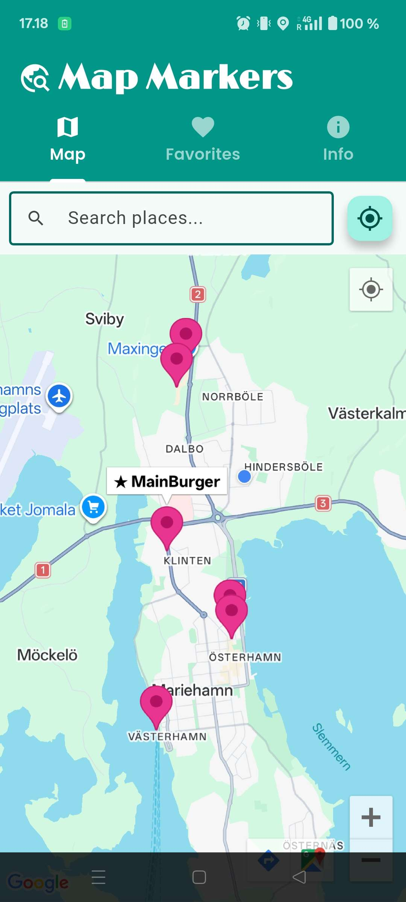
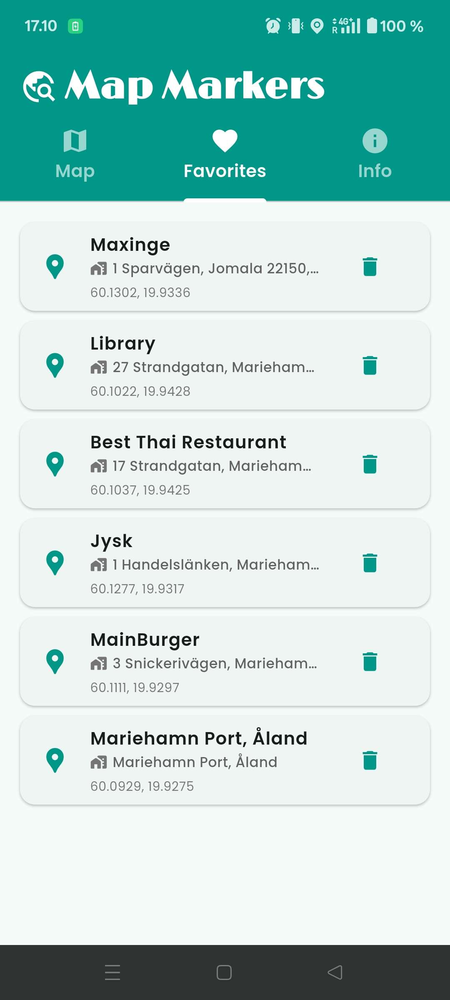
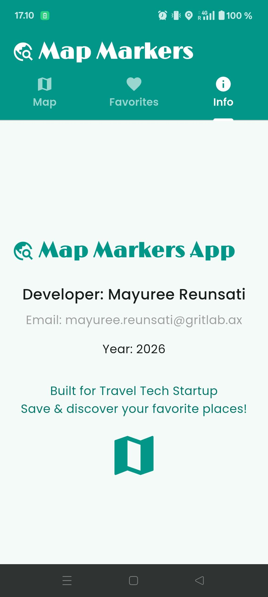

# Map Markers

**Map Markers** is a prototype Flutter application developed for a **travel tech startup**. The mission of this project is to provide a polished, map-based app that allows users to bookmark and browse their favorite locations on an interactive map for an upcoming investor demo. The application features a clean tabbed interface, persistent storage, and integrated search functionality.

## ✨ Key Features

*   **Interactive Google Map:** Displays the user's favorite places as markers and provides real-time location tracking.
*   **Place Search:** Includes a search bar that queries the **Google Places API** for address suggestions and navigates the map to the selected result.
*   **Persistent Favorites:** Saves bookmarked locations using `shared_preferences` so they persist even after the app is closed.
*   **Favorites Management:** A dedicated screen to view a list of saved locations with the ability to delete them, which automatically removes their corresponding marker from the map.
*   **Current Location:** A dedicated button to quickly navigate the map back to the user's current GPS position.
*   **Info Screen:** Displays developer details, contact information, and a general app description.


## Tech Stack

*   **Framework:** Flutter
*   **Map Rendering:** `google_maps_flutter` 
*   **Location Services:** `geolocator` 
*   **Persistence:** `shared_preferences` 
*   **UI/Design:** `google_fonts` (Poppins) and Material 3 
*   **Configuration:** `flutter_dotenv` for managing external API keys

## 📱 Screenshots

| Map screen | Favorite screen | Info screen|
| ---------- | ---------------- | --------- |
|  |  |  |   


## 🚀 Getting Started

### Prerequisites

1.  **Google Maps API Key:** You must obtain an API key from the Google Cloud Console with the Maps SDK and Places API enabled.
2.  **Environment Setup:** Ensure you have a `.env` file in the root directory to store your API keys safely.

### Platform Configuration

#### Android
Add your API key and the necessary location permissions to the `AndroidManifest.xml` file.
```
<uses-permission android:name="android.permission.ACCESS_COARSE_LOCATION"/>
<uses-permission android:name="android.permission.ACCESS_FINE_LOCATION"/>
```

#### iOS
Add your API key to `AppDelegate.swift` and the following to your `Info.plist` to allow the app to access device location services:
```
<key>NSLocationWhenInUseUsageDescription</key>
<string>This app needs access to location when in use.</string>
<key>NSLocationAlwaysUsageDescription</key>
<string>This app needs access to location.</string>
```

### Installation

1.  Clone the repository and install dependencies:
    ```bash
    flutter pub get
    ```
2.  Run the application:
    ```bash
    flutter run
    ```
    *Note: It is recommended to test location services on a **physical device** for the most reliable results.*

## Project Structure

````
map_markers/
├── lib/
│   ├── main.dart
│   ├── screens/
│   │   ├── search_bar.dart
│   │   ├── map_screen.dart
│   │   ├── favorite_screen.dart
│   │   └── info_screen.dart
│   ├── models/
│   │   └── favorite_place.dart
├── assets/
│   └── images/    
├── pubspec.yaml   # manages dependencies and assets
├── .env
````


The app is built around a `TabBar` with three primary screens:
*   **Maps Screen:** The core interface for searching and viewing markers.
*   **Favorites Screen:** A list view of all bookmarked places.
*   **Info Screen:** Static information regarding the project's authors.

## Developer Information

*   **Developer:** [Mayuree Reunsati](https://github.com/mareerray)
*   **Email:** mayuree.reunsati@gritlab.ax 
*   **Year:** 2026 
*   **Context:** Built for Travel Tech Startup 
